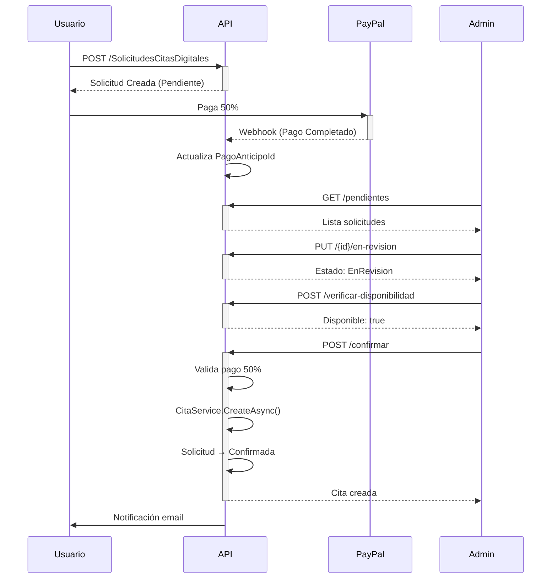

# API Citas y Solicitudes Digitales - Panel Administrativo

> **Nota:** Los endpoints de este documento están restringidos para roles administrativos (**Admin**, **Veterinario**, **Recepcionista**). Los usuarios con rol **Adoptante** NO pueden acceder a estos endpoints.

---

## 📋 Endpoints de Citas

### 1. Obtener Todas las Citas

```http
GET /api/v1/Citas
Authorization: Bearer {token}
Roles: Admin, Veterinario, Recepcionista
```

**Respuesta:**

```json
{
  "success": true,
  "data": [
    {
      "id": "guid",
      "mascotaNombre": "Max",
      "propietarioNombre": "Juan Pérez",
      "veterinarioNombre": "Dr. González",
      "salaNombre": "Sala 1",
      "tipo": "Consulta",
      "status": "Programada",
      "startAt": "2024-01-20T10:00:00",
      "duracionMin": 30
    }
  ]
}
```

---

### 2. Obtener Cita por ID

```http
GET /api/v1/Citas/{id}
Authorization: Bearer {token}
```

---

### 3. Obtener Citas por Veterinario

```http
GET /api/v1/Citas/veterinario/{veterinarioId}?startDate=2024-01-01&endDate=2024-01-31
Authorization: Bearer {token}
```

---

### 4. Obtener Citas por Propietario

```http
GET /api/v1/Citas/propietario/{propietarioId}
Authorization: Bearer {token}
```

---

### 5. Obtener Citas por Estado

```http
GET /api/v1/Citas/estado/{status}
Authorization: Bearer {token}
```

**Estados:** `Programada`, `Completada`, `Cancelada`, `NoAsistio`, `EnProceso`

---

### 6. Crear Cita

```http
POST /api/v1/Citas
Authorization: Bearer {token}
Roles: Admin, Veterinario, Recepcionista
Content-Type: application/json
```

**Body:**

```json
{
  "solicitudCitaDigitalId": "guid-opcional",
  "mascotaId": "guid",
  "propietarioId": "guid",
  "veterinarioId": "guid-requerido",
  "salaId": "guid-opcional",
  "tipo": "Consulta",
  "startAt": "2024-01-20T10:00:00",
  "duracionMin": 30,
  "motivoConsulta": "Revisión general",
  "notas": "Primera visita"
}
```

**Tipos de Cita:** `Consulta`, `Cirugia`, `Baño`, `Vacuna`, `Procedimiento`, `Urgencia`, `Seguimiento`

**🔹 Integración con Solicitudes Digitales:**

- Si se proporciona `solicitudCitaDigitalId`, el sistema valida:
  - Que el pago del 50% esté completado
  - Que la solicitud esté en estado `PagadaPendienteConfirmacion` o `EnRevision`
  - Vincula automáticamente el pago a la cita
  - Actualiza la solicitud a estado `Confirmada`

---

### 7. Actualizar Cita

```http
PUT /api/v1/Citas/{id}
Authorization: Bearer {token}
Roles: Admin, Veterinario, Recepcionista
Content-Type: application/json
```

**Body:** (todos los campos son opcionales)

```json
{
  "veterinarioId": "guid",
  "salaId": "guid",
  "startAt": "2024-01-20T11:00:00",
  "duracionMin": 45,
  "motivoConsulta": "Actualizado",
  "notas": "Cambio de horario"
}
```

---

### 8. Cancelar Cita

```http
PUT /api/v1/Citas/{id}/cancelar
Authorization: Bearer {token}
Roles: Admin, Veterinario, Recepcionista
Content-Type: application/json
```

**Body:**

```json
{
  "motivoRechazo": "Cliente solicitó cambio de fecha"
}
```

**🔹 Sincronización Automática:**

- Si la cita proviene de una solicitud digital, actualiza la solicitud a estado `Cancelada`

---

### 9. Completar Cita

```http
PUT /api/v1/Citas/{id}/completar
Authorization: Bearer {token}
Roles: Admin, Veterinario
Content-Type: application/json
```

**Body:**

```json
{
  "notas": "Cita completada exitosamente"
}
```

---

### 10. Eliminar Cita

```http
DELETE /api/v1/Citas/{id}
Authorization: Bearer {token}
Roles: Admin
```

⚠️ **Solo Administradores** - Eliminación permanente

---

### 11. Obtener Disponibilidad

```http
GET /api/v1/Citas/disponibilidad?veterinarioId={guid}&fecha=2024-01-20
Authorization: Bearer {token}
```

**Respuesta:**

```json
{
  "success": true,
  "data": {
    "fecha": "2024-01-20",
    "horariosDisponibles": [
      {
        "horaInicio": "09:00:00",
        "horaFin": "09:30:00",
        "disponible": true
      },
      {
        "horaInicio": "10:00:00",
        "horaFin": "10:30:00",
        "disponible": false,
        "motivo": "Ocupado"
      }
    ]
  }
}
```

---

### 12. Obtener Cita por Solicitud Digital

```http
GET /api/v1/Citas/solicitud/{solicitudId}
Authorization: Bearer {token}
```

🆕 **Nuevo** - Consulta la cita creada desde una solicitud digital

---

## 📋 Endpoints de Solicitudes Digitales

### 1. Obtener Solicitudes Pendientes

```http
GET /api/v1/SolicitudesCitasDigitales/pendientes
Authorization: Bearer {token}
Roles: Admin, Veterinario, Recepcionista
```

**Respuesta:**

```json
{
  "success": true,
  "data": [
    {
      "id": "guid",
      "numeroSolicitud": "SC-20240120-1234",
      "nombreSolicitante": "Juan Pérez",
      "nombreMascota": "Max",
      "fechaHoraSolicitada": "2024-01-25T10:00:00",
      "estado": 1,
      "estadoNombre": "Pendiente",
      "costoEstimado": 500.0,
      "montoAnticipo": 250.0,
      "disponibilidadVerificada": true
    }
  ]
}
```

---

### 2. Obtener Solicitud por ID

```http
GET /api/v1/SolicitudesCitasDigitales/{id}
Authorization: Bearer {token}
```

---

### 3. Marcar como En Revisión

```http
PUT /api/v1/SolicitudesCitasDigitales/{id}/en-revision
Authorization: Bearer {token}
Roles: Admin, Veterinario, Recepcionista
```

**Efecto:** Actualiza estado a `EnRevision` y registra quién está revisando

---

### 4. Verificar Disponibilidad

```http
POST /api/v1/SolicitudesCitasDigitales/verificar-disponibilidad
Authorization: Bearer {token}
Content-Type: application/json
```

**Body:**

```json
{
  "fechaHoraInicio": "2024-01-25T10:00:00",
  "duracionMin": 60,
  "veterinarioId": "guid-opcional",
  "salaId": "guid-opcional"
}
```

**Respuesta:**

```json
{
  "success": true,
  "data": {
    "disponible": true,
    "mensaje": "Horario disponible",
    "conflictos": []
  }
}
```

---

### 5. Confirmar Solicitud (Crea Cita Automáticamente)

```http
POST /api/v1/SolicitudesCitasDigitales/confirmar
Authorization: Bearer {token}
Roles: Admin, Veterinario, Recepcionista
Content-Type: application/json
```

**Body:**

```json
{
  "solicitudId": "guid",
  "veterinarioId": "guid",
  "salaId": "guid-opcional",
  "fechaHoraConfirmada": "2024-01-25T10:00:00",
  "duracionMin": 60,
  "confirmadoPorId": "guid-usuario-admin"
}
```

**🔹 Validaciones Automáticas:**

- ✅ Verifica pago del 50% completado
- ✅ Valida monto mínimo (MontoAnticipo)
- ✅ Verifica disponibilidad de veterinario/sala
- ✅ Crea la cita automáticamente usando `CitaService`
- ✅ Vincula el pago a la cita (`PagoId`)
- ✅ Actualiza solicitud a `Confirmada`
- ✅ Crea recordatorios automáticos

---

### 6. Rechazar Solicitud

```http
POST /api/v1/SolicitudesCitasDigitales/rechazar
Authorization: Bearer {token}
Roles: Admin, Veterinario, Recepcionista
Content-Type: application/json
```

**Body:**

```json
{
  "solicitudId": "guid",
  "motivo": "No hay disponibilidad en esa fecha",
  "rechazadoPorId": "guid-usuario-admin"
}
```

---

## 🔄 Flujo de Trabajo Completo

### Escenario: Usuario Solicita Cita Online



---

## 📊 Estados de Solicitud

| Estado                      | Valor | Descripción                    |
| --------------------------- | ----- | ------------------------------ |
| Pendiente                   | 1     | Recién creada, sin revisar     |
| EnRevision                  | 2     | Personal revisándola           |
| PendientePago               | 3     | Aprobada, esperando pago       |
| PagadaPendienteConfirmacion | 4     | Pago recibido, falta confirmar |
| Confirmada                  | 5     | Cita creada exitosamente       |
| Rechazada                   | 6     | Rechazada por personal         |
| Cancelada                   | 7     | Cancelada por usuario/admin    |
| Expirada                    | 8     | Tiempo límite de pago vencido  |

---

## ⚠️ Restricciones Importantes

### Roles NO Permitidos

❌ **Adoptante** - No puede acceder a estos endpoints administrativos

### Validaciones de Negocio

- ✅ Pago del 50% obligatorio antes de confirmar
- ✅ No se pueden crear citas en el pasado
- ✅ Verificación de disponibilidad de veterinario/sala
- ✅ Duración: mínimo 15 min, máximo 480 min (8 horas)

---

## 🔗 Integración entre Módulos

### Citas ↔ Solicitudes Digitales

**Al crear cita desde solicitud:**

```http
POST /api/v1/Citas
{
  "solicitudCitaDigitalId": "guid",
  ...
}
```

- Valida pago 50%
- Usa datos de la solicitud
- Actualiza solicitud a `Confirmada`

**Al cancelar cita vinculada:**

```http
PUT /api/v1/Citas/{id}/cancelar
```

- Busca solicitud asociada
- Actualiza solicitud a `Cancelada`

---

## 📞 Contacto

**Módulo:** Clínica & Historial Médico  
**Versión:** 1.1  
**Última Actualización:** Enero 2024
